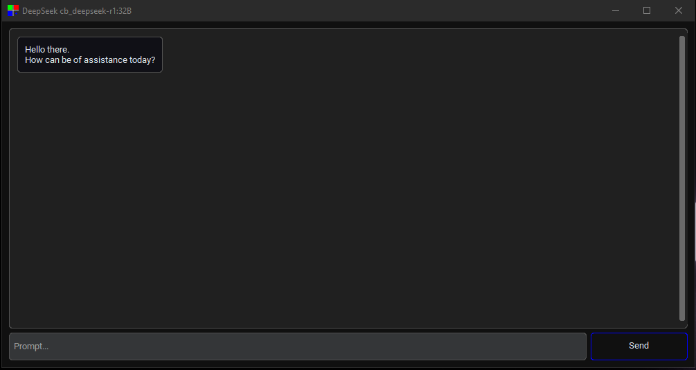

# DeepSeek-R1_distilled

A lightweight Python application hosting deepseek-r1 Large Language Model ran locally.



## Requirements
- Python 3.7+
- Libraries: `customtkinter`, `ollama`, `pillow`
- Ollama (for handling the model)
- Deepseek-r1 Reasoning Model

## Installation
1. Clone the repository:
   ```bash
   git clone https://github.com/PETROUNKNOWN/DeepSeek-R1_distilled.git

2. Install the required libraries:
    ```bash
    pip install customtkinter ollama pillow

4. Ollama:
    - Download Ollama from [Ollama.com](https://ollama.com/)
    - macOS
        - Open the `.dmg` file you downloaded.
        - Drag and drop the Ollama app icon into the Applications folder.
        - Open Finder, go to Applications, and double-click the Ollama app to launch it.
    - Windows
        - Double-click the .exe file you downloaded.
        - Follow the on-screen instructions in the installation wizard.
        - Choose the installation location (default is fine for most users).
        - Once the installation is complete, find Ollama in the Start Menu or Desktop and open it.
    - Linux
        - Open a terminal.
        - Navigate to the directory where the downloaded file is located.
        - Run the appropriate command based on the file type:
          ```bash
          sudo dpkg -i ollama.deb
          sudo apt-get install -f
          ```
        - For .rpm (Fedora/RedHat-based systems):
          ```bash
          sudo rpm -ivh ollama.rpm
          ```
        - Once installed, launch Ollama from the Applications menu or by running ollama in the terminal.
     - In a terminal:
       ```bash
       ollama serve
       ```
     - An Ollama http instance should now be running on port `11434`:
         - Visiting `localhost:11434` will take you to a page that says `Ollama is running`

5. Model deepseek-r1:
     - In a teminal:
       ```bash
       ollama run deepseek-r1:8b
       ```
    

## Note
- The model requires a lot of compute hence a dedicated GPU is highly recommended
- The Model download requires 4.9GB of disk space although one could go with a 20.0GB one. <br>Instead of `ollama run deepseek-r1:8b` use `ollama run deepseek-r1:32b`
- You are recommended to search online other things Ollama can do including other models you can run instead of DeepSeek's deepseek-r1 Model.


<!-- syndicat -->
